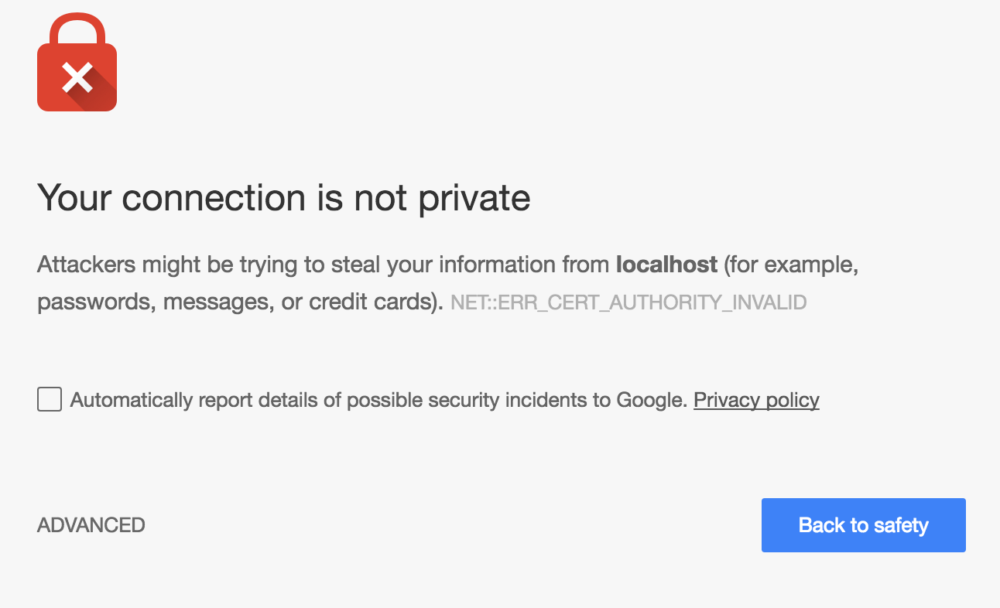
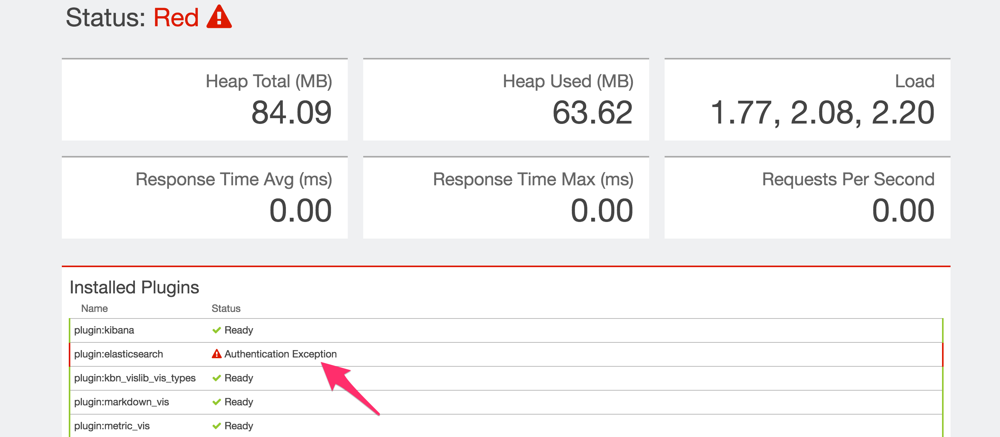
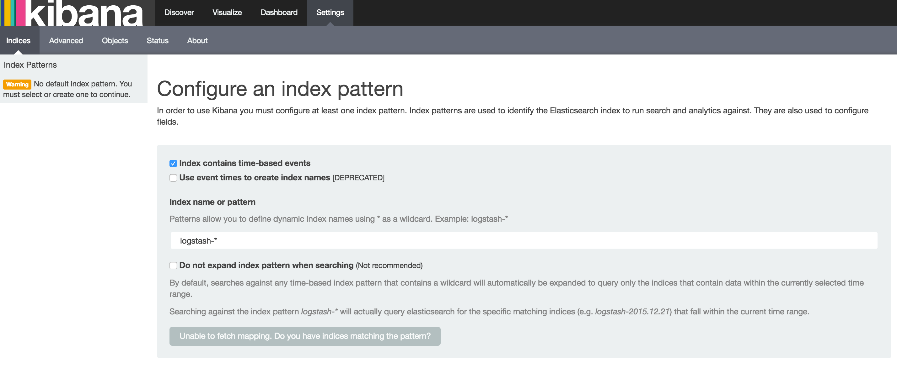

<!---
Copryight 2016 floragunn UG (haftungsbeschränkt)
-->

# Using Search Guard with Kibana

Search Guard is compatible with [Kibana](https://www.elastic.co/products/kibana). Since Kibana mainly acts as a client (or to be more precise: a proxy) for Elasticsearch, you can use nearly all features of Search Guard also in combination with Kibana. 

In the following description, we assume that you have already set up an Search Guard secured Elasticsearch instance. We'll walk through all additional steps needed for integrating Kibana with your setup. 

We also assume that you have enabled TLS support on the REST-layer via Search Guard SSL. While this is optional, we strongly recommend to use this feature. Otherwise, all traffic between Kibana and Elasticsearch is made via unsecure HTTP calls, and thus can be sniffed.

Please check the `elasticsearch.yml` file and see whether TLS on the REST-layer is enabled:

```
searchguard.ssl.http.enabled: true
searchguard.ssl.http.keystore_filepath: ...
searchguard.ssl.http.keystore_password: ...
searchguard.ssl.http.truststore_filepath: ...
searchguard.ssl.http.truststore_password: ...
```
If in doubt, please refer to the [Search Guard SSL configuration documentation](https://github.com/floragunncom/search-guard-ssl-docs/blob/master/configuration.md).

Again, since all configuration changes for Search Guard regarding users, permissions and authentication methods can be hot reloaded, you can play around with different configuration settings without the need to restart you nodes.

**Note that all changes to the configuration files need to be published to Search Guard by using the `sgadmin` command line tool to take effect.**

## Setting up SSL/TLS

If you use TLS on the Elasticsearch REST-layer (as you should), you need to configure Kibana accordingly. This is done in the kibana.yml configuration file. Simply set the protocol on the entry `elasticsearch.url` to `https`:

```
elasticsearch.url: "https://localhost:9200" 
```

All requests that Kibana makes to Elasticsearch are now using HTTPS instead of HTTP.

### Configuring the Root CA

Since Kibana acts as a proxy for Elasticsearch, the handling of certificates is very similar to that of a browser. If you use your own Root CA on Elasticsearch, this especially means that Kibana checks whether the certificate can be trusted or not.

If you use your own Root CA, this is obviously not the case. If you use a browser to connect, you would get an error message like this:



Kibana also checks the certificates validity. If it regards the certificate invalid, you will see a log file entry like this:

```
Request error, retrying -- self signed certificate in certificate chain
```

To mitigate this, you need to provide the Root CA in pem format for Kibana. This is basically the same as installing the Root CA as trusted CA on your browser. Add this line to your kibana.yml file, and make sure to use an absolute file path:

```
elasticsearch.ssl.ca: "/path/to/your/root-ca.pem"
```

Another, but not recommended, way to avoid this problem is to disable the validity check of the CA completely. Please use this setting for testing only, and not on production clusters:

```
elasticsearch.ssl.verify: false
```

## Configuring the Kibana server user

### Adding the Kibana server user

At this point, if you simply start Kibana, you will see an Authentication Exception in the logfile:

```
[plugin:elasticsearch] Status changed from yellow to red 
- Authentication Exception
```

And if you try to access Kibana, you will see the Authentication Exception also in the list of plugins:



Why? Kibana works by setting up its own index (default name `.kibana`) in your Elasticsearch cluster. Since we secured Elasticsearch with Search Guard, you need to also set up this user in Search Guard, and grant all permissions to create and modify the `.kibana` index to this user. If you do not do this, Search Guard will reject the requests from Kibana, hence the Authentication Exception.

First, we'll need to specify the username and password of the Kibana server user. Add or uncomment the following lines in the `kibana.yml` file, and choose a username and password:

```
elasticsearch.username: "kibanaserver"
elasticsearch.password: "password"
```

### Setting the permissions

Next, we need to define this user and its permissions in Search Guard. As being said, the user needs full access to the `.kibana` index, and additionally monitoring permissions on cluster level.

Edit the file `sg_roles.yml`, and add the following role- and permission definition:

```
sg_kibana4_server:
  cluster:
      - cluster:monitor/nodes/info
      - cluster:monitor/health
  indices:
    '?kibana':
      '*':
        - "indices:*"
```

This gives users with role `sg_kibana4_server` all required permissions. 

### Mapping the user to the correct role

Next, we'll map the user `kibanaserver` to the role `sg_kibana4_server`. Open the file `sg_roles_mapping` and add the following lines:

```
sg_kibana4_server:
  users:
    - kibanaserver
```

Since Kibana uses HTTP basic authentication, we can map the user directly via username, and do not need to use any backend roles. However, depending on your setup, it would of course also be possible to define and use backend roles for the mapping. But in almost all cases mapping the username directly will be sufficient.

### Configuring the authenticator

Now it's time to configure the authentication and authorization method. Note that this configuration depends on which authentication backend you want to use. We will show examples for both internal and LDAP authentication backends.

The only fixed requirement is that you use HTTP basic auth as authentication method.

#### Example: Internal authentication

If you want to use the internal Search Guard user database as authentication method, add the user kibanaserver to the file `sg_internal_users.yml` and publish the changes via `sgadmin`:

```
kibanaserver:
  hash: $2a$12$4AcgAt3xwOWadA5s5blL6ev39OXDNhmOesEoo33eZtrq2N0YrU3H.
  #password is: kibanaserver
```

If you want to use a differen password, generate a hash from the cleartext password by using the `hasher` script shipped with Search Guard.

Next, we configure the authentication domain in sg_config to a) use HTTP basic auth as authenticator, and b) the internal user database as authentication backend:

```
searchguard:
  dynamic:
    http:
     ...
    authc:
      kibana_auth_domain: 
        enabled: true
        order: 1
        http_authenticator:
          type: basic
          challenge: true
        authentication_backend:
          type: internal
    authz:
      ...
```

After applying these settings, Kibana should now start up without any errors.

#### Example: LDAP authentication

If you want to use LDAP as authentication method, you need to add the user `kibanaserver` to your directory first. Make sure that the password matched the configured password in `kibana.yml`.

A sample configuration for LDAP might look like this:

```
searchguard:
  dynamic:
    http:
     ...
    authc:
      kibana_auth_domain: 
        enabled: true
        order: 1
        http_authenticator:
          type: basic
          challenge: true
        authentication_backend:
          type: ldap
          config:
            enable_ssl: false
            enable_start_tls: false
            enable_ssl_client_auth: false
            verify_hostnames: true
            hosts:
              - localhost:8389
            bind_dn: null
            password: null
            userbase: 'ou=people,dc=floragunn,dc=com'
            # Filter to search for users (currently in the whole subtree beneath userbase)
            # {0} is substituted with the username 
            usersearch: '(uid={0})'
            # Use this attribute from the user as username (if not set then DN is used)
            username_attribute: uid
    authz:
      ...
```    

Of course you need to adapt the settings to your own LDAP installation. Note that there is nothing special about this configuration regarding Kibana. The only requirement is that the user `kibanaserver` exists and has the correct credentials.

### Testing the installation

After you configured the `kibanaserver` user and refreshed all configuration files via `sgadmin`, simply start Kibana. You should see the familiar log entry:

```
Status changed from yellow to green - Kibana index ready
```

If you encounter any error, please refer to the "Troubleshooting" section of this chapter.

We did not add any real user up until now, but for testing purposes, we can also use the `kibanaserver` user to validate our installation.

Open a browser, and access Kibana normally. If you have it installed locally, go to

```
localhost:5601
```

Kibana should now prompt you for a username and password by a regular HTTP basic auth dialog:


Type in the username and password of your `kibanaserver` user, and you should be able to access Kibana without errors:



## Adding Kibana user

Adding Kibana users is no different from adding any other user to Search Guard, and consist basically of the same steps you did for configuring the Kibana server user. You need to:

* Add the users to your authentication backend (e.g. LDAP, internal Search Guard database)
* Define a role mapping for these users
* Set the permissions for these roles

In our example, we assume that Kibana is used in conjunction with logstash, and that we have the following indices stored in Elastic:

```
logstash-staging-2016-06-17
logstash-production-2016-06-17
```

Every day, a new index is created for both staging and production systems, and the indexname is appended with the current date.

Our goal is to configure two kinds of users:

* Administrators: These users can see all logstash indices
* Developers: These users can only see logstash staging indices

Administrators and developers are organized in teams, and are thus members of the role/group `administrator-team1 / administrator-team2` or `developer-team1 / developer-team2`.

To keep this example simple, we will use the internal authentication backend, but you can of course use any backend you like.

First, we add some users to the `sg_internal_users.yml` and give them the role admin or developer respectively:

```
admin1:
  hash: $2a$12$Evc8Xm6Pov2TpPO.JO8K3ul/W2LfDdQbhbet22l48UDCKzDFdwQKO
  roles:
    - administrator-team1
admin2:
  hash: $2a$12$Evc8Xm6Pov2TpPO.JO8K3ul/W2LfDdQbhbet22l48UDCKzDFdwQKO
  roles:
    - administrator-team2
developer1:
  hash: $2a$12$Evc8Xm6Pov2TpPO.JO8K3ul/W2LfDdQbhbet22l48UDCKzDFdwQKO
  roles:
    - developer-team1
developer1:
  hash: $2a$12$Evc8Xm6Pov2TpPO.JO8K3ul/W2LfDdQbhbet22l48UDCKzDFdwQKO
  roles:
    - developer-team2  
```
For the sake of this tutorial, we assigned the same password to all users, nameld `kibana`. 

The roles we defined here are so called backend roles, for they stem from the authentication backend. Next, we'll need to map these backend roles to Search Guard roles, for which we will set up the permissions. We want to set up two Search Guard roles, called `administrators` and `developers`, and map both administrator- and developer-roles that came from the backend to them.

Edit the `sg_roles_mapping.yml` and add:

```
administrators:
  backendroles:
    - administrator-team1
    - administrator-team2
developers:
  backendroles:
    - developer-team1
    - developer-team2  
```

Note that this configuration is based on backend roles. If you want to map users directly, you can also use:

```
administrators:
    users:
    - admin1
    - admin2
developers:
    users:
    - developer1
    - developer1  
```

Of course, also combinations of user- and role-based mapping are possible, and you can even throw in hostnames or IP addresses if required.

Now we need to set up the permissions for these roles. Our goal is that users that have the `admin` role have access to all indices starting with `logstash`. Users that have the role `dev` must only see indices starting with `logstash-staging`.

This is done in `sg_roles.yml`. We define one set of permissions for admins, and one for developers. We base the set of permission based on the indexname, and work with wildcards.

The definition for the `administrators` role looks like:

```
administrators:
  indices:
    'logstash-*':
      '*':
        - indices:data/read*
        - indices:admin/mappings/fields/get*
        - indices:admin/validate/query*
        - indices:admin/get*
    '?kibana':
      '*':
        - indices:admin/exists*
        - indices:admin/mapping/put*
        - indices:admin/mappings/fields/get*
        - indices:admin/refresh*
        - indices:admin/validate/query*
        - indices:data/read/get*
        - indices:data/read/mget*
        - indices:data/read/search*
        - indices:data/write/delete*
        - indices:data/write/index*
        - indices:data/write/update*
```

First, let's look at the permissions for the logstash index. The permissions, including mainly all read permissions and some limited admin permissions (needed because of the inner workings of Kibana), are applied to every index starting with `logstash-`, due to the wildcard we use. The permissions are applied to any document type.

Due to the nature of Kibana, the logged in user also needs permission to access (read and write) the .kibana index.

So, our permissions list is quite long. Since we need the same set of permissions also for the `developers` role, we would need to repeat all these settings also for this role.

Here is where action groups come to the rescue. We will move the definition of both permission lists to `sg_action_groups.yml` and then just reference them in `sg_roles.yml`.

`sg_action_groups.yml`:

```
KIBANA_SERVER:
  - indices:admin/exists*
  - indices:admin/mapping/put*
  - indices:admin/mappings/fields/get*
  - indices:admin/refresh*
  - indices:admin/validate/query*
  - indices:data/read/get*
  - indices:data/read/mget*
  - indices:data/read/search*
  - indices:data/write/delete*
  - indices:data/write/index*
  - indices:data/write/update*

KIBANA_USER:
  - indices:data/read*
  - indices:admin/mappings/fields/get*
  - indices:admin/validate/query*
  - indices:admin/get*
```

And our changed `sg_roles.yml`:

```
administrators:
  indices:
    'logstash-*':
      '*':
        - KIBANA_USER
    '?kibana':
      '*':
        - KIBANA_SERVER
```

Now we can easily add the `developers` role to this file. The only difference is that the index permissions apply only to indices starting with `logstash-staging`:

```
developers:
  indices:
    'logstash-staging-*':
      '*':
        - KIBANA_USER
    '?kibana':
      '*':
        - KIBANA_SERVER
```

That's it. We have set up our users, roles and permissions. As a test, log in with a developer user, and try to access the index `logstash-production-*`. In the logfile of Elasticsearch, you should see an entry like this:

```
No perm match for indices:admin/mappings/fields/get and [developers]
```

This means that the user does not have the permission to execute the `admin/mappings/fields/get` action on the index `logstash-production-*`. And that means, our setup works as expected.


## Troubleshooting

Most configuration errors somehow manifest not in the Kibana logs, but in the Elasticsearch logs. So, if something does not work as expected, please have a look in the Elasticsearch logs first. We've listed some of the more common configuration errors below. Feel free to contribute, or contact us if you feel something is missing.

### General: Configuration changes do not take effect

Since Search Guard keeps its configuration settings in it own Elasticsearch indes, any changes to the configuration files need to be pushed to Elasticsearch by using the `sgadmin` command line tool.

After you have pushed your configuration changes, pay attention to the Elasticseach logfile, and especially look for any parsing errors like:

```
Exception in thread "main" MapperParsingException[failed to parse [admin.indices]]; nested: IllegalArgumentException[unknown property [*]];
...
```

In most cases, the syntax of the configuration file(s) are/is not correct. YAML is very picky about indentation, so please first check if this is correct. Also, some characters, such as the asterisk, need to be put in single quotes. If in doubt, use an YAML validator to check your files.

### General: Authenticated user seems to have the wrong roles

If you are able to log in with your credentials to a Search Guard secured Elasticsearch installation, you can view the settings for this user as seen by Search Guard by entering

```
https://localhost:9200/_searchguard/authinfo
```

in your browser. The output (from our example above) should look like:

```
{

"user": "User [name=admin1, roles=[administrator-team1]]",
....
"sg_roles": [
    "administrators",
    "sg_public"
],
...
}
```

This call will output the backend roles, and the mapped Search Guard roles for the authenticated user.

### Kibana: No HTTP basic auth dialog pops up

Make sure that you set the `challenge` field in the configuration of the http authenticator in the `sg_config.yml` to true:

```
http_authenticator:
  type: basic
  challenge: true
```

### Kibana: "No such file or directory" Exception

```
[fatal] Error: ENOENT: no such file or directory, open '/../../root-ca.pem'
    at Error (native)
    at Object.fs.openSync (fs.js:549:18)
    at Object.fs.readFileSync (fs.js:397:15)
```

This means that the Root CA configured in `kibana.yml` could not be found. Check the path to your certificate:

```
elasticsearch.ssl.ca: "/path/to/your/root-ca.pem"
```

### Kibana: "self signed certificate"

If in the Kibana logfile you'll get:

```
Request error, retrying -- self signed certificate in certificate chain
```

This means that Kibana could not validate the Root CA used by your Elasticsearch installation. Please review the chapter "Configuring the Root CA" for instructions how to set up the Root CA in Kibana correctly.

### Elasticsearch: "No user ... found"

```
Caused by: ElasticsearchSecurityException[No user ... found]
...
```

The user that is trying to log in could not be found by the configured authentication backend. Depending on what technology you use (e.g. internal Search Guard user database, LDAP), make sure that the user is configured correctly.
	
### Elasticsearch: "Cannot authenticate user"

```
[2016-06-18 16:40:55,666][INFO ]
[com.floragunn.searchguard.auth.BackendRegistry] Cannot authenticate user (or add roles) with ad 1 due to
ElasticsearchSecurityException[com.google.common.util.concurrent.UncheckedExecutionException: 
ElasticsearchSecurityException[password does not match]]; nested: UncheckedExecutionException[ElasticsearchSecurityException[password does not match]]; nested: 
ElasticsearchSecurityException[password does not match];, try next
```

This simply means that the user could not be authenticated. The reasons can vary, most likely the password is not correct (as in the example above). Depending on what technology you use (e.g. internal Search Guard user database, LDAP), make sure that the user is configured correctly.

Also, pay attention to the `ad` entry in the logfile. `ad` means "authentication domain" and refers to the order of the configured domains in the `sg_config.yml` file. If you see `with ad 1`, this refers to the domain with `order: 1`:

```
basic_internal_auth_domain: 
  enabled: true
  order: 1
```
